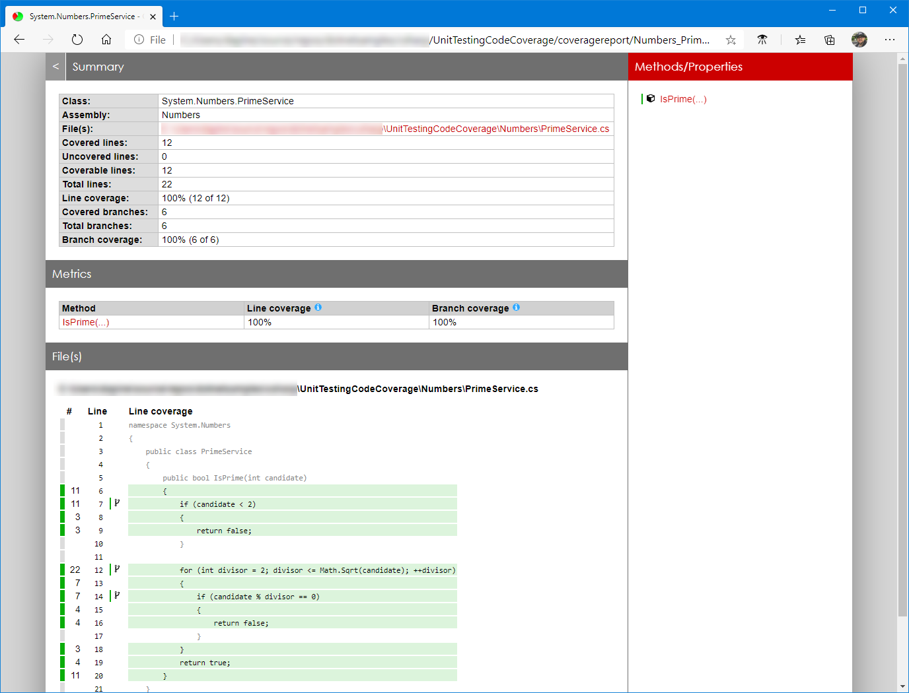

# Couverture de code
Les tests unitaires sont pratiques et il peut être pertinent de vérifier leur étendue.

À ce titre on utilise la notion de *couverture de code* qui mesure les parties du code réellement éxécutées lors des tests.

**ATTENTION**: une couverture de 100% n’implique pas que tous les cas sont testés, juste que tous les chemins de code sont éxécutés. Ceci implique qu’on peut toujours avoir des bogues avec des valeurs particulières (extrêmes par exemple avec des overflows...)

## Comment faire ?
Il faut
- utiliser *xunit* pour les tests (et pas MSTEST)
- générer un rapport cobertura en xml
- convertir le rapport en html

### Concrètement
[Suivre le guide officiel](https://learn.microsoft.com/en-us/dotnet/core/testing/unit-testing-code-coverage?tabs=windows)

# Objectif
Une page HTML avec un pourcentage >=80%
